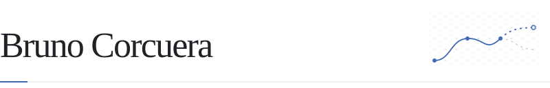

<picture>
  <source media="(prefers-color-scheme: dark)" srcset="assets/header-dark.svg" />
  <source media="(prefers-color-scheme: light)" srcset="assets/header-light.svg" />
  
</picture>

  <strong>PhD student · LIDIA</strong> · Universidade da Coruña 
  World Models · Representation Learning · Generative Models

  <a href="mailto:bruno.sanchez1@udc.es"><picture><source media="(prefers-color-scheme: dark)" srcset="assets/buttons/email-dark.svg" /><source media="(prefers-color-scheme: light)" srcset="assets/buttons/email-light.svg" /></picture></a>&nbsp;
  <a href="https://www.linkedin.com/in/brunocorcuera/"><picture><source media="(prefers-color-scheme: dark)" srcset="assets/buttons/linkedin-dark.svg" /><source media="(prefers-color-scheme: light)" srcset="assets/buttons/linkedin-light.svg" /></picture></a>&nbsp;
  <a href="https://x.com/brunocorcueras"><picture><source media="(prefers-color-scheme: dark)" srcset="assets/buttons/x-dark.svg" /><source media="(prefers-color-scheme: light)" srcset="assets/buttons/x-light.svg" /></picture></a>

My research explores how agents use compact visual representations to predict observations and choose actions. I am supervised by Brais Cancela at LIDIA, Universidade da Coruña.

#### Selected research

Unsupervised Dynamic Feature Selection for Robust Latent Spaces in Vision Tasks 
Preprint · 2025 · <a href="https://arxiv.org/abs/2510.01758">arXiv ↗</a>

Instance-specific, unsupervised feature selection for robust visual representations.

<a href="https://github.com/BrunooCS?tab=repositories">All repositories ↗</a>
